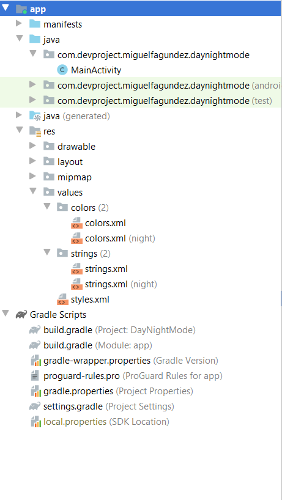

# DayNight-Mode
Example Day/Night Mode using Java (Setting option)

## Modifying /res folder.

New AppTheme:

```
<style name="AppTheme" parent="Theme.AppCompat.DayNight.DarkActionBar">
```

Create a new values-night folder (colors and strings). Include colors and string for both, Day and Night Mode:

<p align="center">

</p>


In my MainActivity, I can use a switch, or buttons, or any other component with listeners.

For Night Mode:

```
    AppCompatDelegate.setDefaultNightMode(AppCompatDelegate.MODE_NIGHT_YES);
```

For Day Mode:

```
   AppCompatDelegate.setDefaultNightMode(AppCompatDelegate.MODE_NIGHT_NO);
```

## Final Result:

<p align="center">
  
</p>
